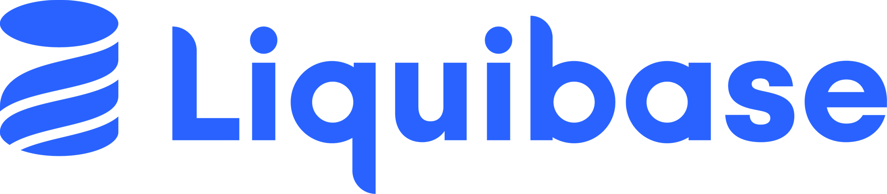

<p align="left">
  
</p>

# 👋 Welcome to Liquibase!
Liquibase Secure (formerly Liquibase Pro) is database change management made easy. This repository contains links to documentation, sample files, and tips for evaluating Liquibase. This evaluation is intended for people interested in learning about the capabilities of Liquibase Secure.


# 📒 Liquibase Documentation
* [Documentation Home](https://docs.liquibase.com/home.html)
* [Liquibase University](https://learn.liquibase.com/)

# 🔧 Installing Liquibase Secure
Liquibase Secure can be [installed locally](https://www.liquibase.com/download-secure) on Windows, Mac, or Linux platforms (e.g., a workstation or automation tool agent/runner) or invoked using our [Docker image](https://hub.docker.com/r/liquibase/liquibase-secure).

To apply your license key, follow the instructions [here](https://docs.liquibase.com/secure/get-started-5-0/apply-your-liquibase-secure-license-key).

# 💡 Liquibase Secure Concepts
If you are unfamiliar with Liquibase, here is some information to get you started.

* [Changeset](https://docs.liquibase.com/secure/user-guide-5-0/what-is-a-changeset): basic unit of database work
* [Changelog](https://docs.liquibase.com/secure/user-guide-5-0/what-is-a-changelog): text file containing collection of changesets
* [Tracking tables](https://docs.liquibase.com/secure/user-guide-5-0/what-is-the-databasechangelog-table): tables created and maintained by Liquibase

Changelog formats can be mixed and matched as desired. Liquibase does not impose any file name requirements.

# 💻 Database Connections
Liquibase supports over [60 databases](https://www.liquibase.com/supported-databases), including data warehouses, relational, and NoSQL.

A [liquibase.properties](https://docs.liquibase.com/community/user-guide-5-0/what-is-the-liquibase-properties-file) file can be used for basic testing. However, it is **strongly** recommended that [environment variables](https://docs.liquibase.com/secure/user-guide-5-0/what-are-liquibase-environment-variables) or a secrets manager extension ([AWS Secrets Manager](https://docs.liquibase.com/secure/integration-guide-5-1/install-the-liquibase-secure-aws-extension), [HashiCorp Vault](https://docs.liquibase.com/secure/user-guide-5-1/what-is-the-liquibase-hashicorp-vault-extension)) be used for any scenario beyond that.

In general, Liquibase needs three pieces of information to connect to a database.

1. [JDBC URL](https://docs.liquibase.com/community/integration-guide-5-0): database connection string
1. Username: typically a service account
1. Password: typically stored within a vault

The exact information required may vary between individual database platforms. Consult [the database documentation](https://docs.liquibase.com/secure/integration-guide-5-0/what-databases-are-supported-by-liquibase) for specific details.

# 🗺️ Where to Start
If you're new to Liquibase Secure, here's a suggested evaluation sequence:

1. Connect — database connectivity test (`connect`)
1. Check your history — log of previously deployed changes (`history`)
1. Review pending changes — list of changes waiting to be deployed (`status`)
1. Run Policy Checks — changelog validation against your organization's rules (`checks run`)
1. Deploy changes — applies pending changes to the target database (`update`)
1. Review the Operation Report — HTML report generated by the previous steps
1. Rollback — undo the last deployment (`rollback-one-update`)
1. Try a Flow — combines the above into a single automated workflow (`flow`)

See the [Helpful Commands](#-helpful-commands) section below for documentation links on each command.

# 📂 Sample Changelogs
* [Root - Mongo - JS](changelog.mongo.json)
    * [JS - Mongo](changesets/changelog.mongo.js)
* [Root - Mongo - XML](changelog.mongo.xml)
    * [JS - Mongo](changesets/changelog.mongo.js)
* [Root - SQL](changelog.relational.sql)
    * [SQL - Relational](changesets/changelog.ddl.sql)
* [Root - XML](changelog.relational.xml)
    * [XML - Relational](changesets/changelog.ddl.xml)
```
/
│   changelog.mongo.xml
│   changelog.relational.sql
│   changelog.relational.xml
│
├───changesets
│       changelog.ddl.sql
│       changelog.ddl.xml
│       changelog.mongo.js
```

# ❓ Helpful Commands
|Command |Description|Documentation
|----------|------------|------------|
| connect | Test database connection | [Link](https://docs.liquibase.com/reference-guide/database-inspection-change-tracking-and-utility-commands/connect)
| flow | Execute a Liquibase workflow (samples are listed below) | [Link](https://docs.liquibase.com/secure/user-guide-5-0/what-is-a-flow-file)
| status | Show undeployed changes | [Link](https://docs.liquibase.com/reference-guide/database-inspection-change-tracking-and-utility-commands/status)
| update | Run changes against target database | [Link](https://docs.liquibase.com/reference-guide/init-update-and-rollback-commands/update)
| history | Show deployed changes | [Link](https://docs.liquibase.com/reference-guide/database-inspection-change-tracking-and-utility-commands/history)
| rollback-one-update | Rollback the last or a specified update | [Link](https://docs.liquibase.com/secure/reference-guide-5-1/init-update-and-rollback-commands/rollback-one-update)
| checks show |  Display available policy checks and their configuration | [Link](https://docs.liquibase.com/secure/reference-guide-5-1/policy-check-and-flow-commands-and-parameter/checks-show)
| checks run |  Execute policy checks against your database or changesets | [Link](https://docs.liquibase.com/secure/reference-guide-5-1/policy-check-and-flow-commands-and-parameter/checks-run)

# 🚀 Liquibase Secure in Automation
Liquibase Secure can work with any automation tool which supports invoking command-line tools. Liquibase provides working examples for some popular automation platforms.

* [Ansible Tower](https://github.com/liquibase/liquibase-toolbox/blob/master/build_scripts_examples/Ansible_Tower/liquibase_playbook.yml)
* [AWS CodeBuild](https://github.com/liquibase/liquibase-toolbox/blob/master/build_scripts_examples/AWS_CodeBuild/buildspec.yml)
* [Azure DevOps](https://github.com/liquibase/liquibase-toolbox/blob/master/build_scripts_examples/Azure_DevOps/azure_pipelines_docker.yml)
* [Bitbucket](https://github.com/liquibase/liquibase-toolbox/blob/master/build_scripts_examples/Bitbucket/bitbucket-pipelines.yml)
* [CircleCI](https://github.com/liquibase/liquibase-toolbox/blob/master/build_scripts_examples/CircleCI/config.yml)
* [GitHub Actions](https://github.com/liquibase/liquibase-toolbox/blob/master/build_scripts_examples/GitHub_Actions/liquibase_workflow.yml)
* [GitLab](https://github.com/liquibase/liquibase-toolbox/blob/master/build_scripts_examples/GitLab/gitlab-ci.yml)
* [Jenkins](https://github.com/liquibase/liquibase-toolbox/blob/master/build_scripts_examples/Jenkins/Jenkinsfile) 

**Note!** If you are using GitHub Actions, Liquibase publishes actions to make setup and execution simple. You can find documentation [here](https://github.com/marketplace/actions/setup-liquibase).

# ⚙️ Liquibase Secure Developer
Official [VS Code IDE Extension](https://docs.liquibase.com/secure-developer/user-guide-1-0/install-and-configure-the-liquibase-secure-developer-vs-code-extension) for Liquibase Secure.

# 🔩 Liquibase Secure Core Capabilities
During a typical evaluation the following features are exercised.

1. [Policy Checks](https://docs.liquibase.com/secure/user-guide-5-0/what-are-policy-checks): similar to static code analysis, but geared more for database changes. Policy Checks can be customized by team, database, etc. Sample Regex and Python checks can be found [here](https://github.com/liquibase/custom_policychecks).
1. [Workflows](https://docs.liquibase.com/secure/user-guide-5-0/what-is-a-flow-file): portable, database independent workflows to ensure consistency
1. [Operation Reports](https://docs.liquibase.com/secure/user-guide-5-0/what-are-operation-reports): HTML reports used for auditing or troubleshooting, created and hosted on your infrastructure
1. [Structured Logging](https://docs.liquibase.com/secure/user-guide-5-0/what-is-structured-logging): JSON formatted logs to feed into an observability tool for reporting (e.g., Datadog, Splunk, Grafana)
1. [DATABASECHANGELOGHISTORY table](https://docs.liquibase.com/secure/user-guide-5-0/what-is-the-database-changelog-history-table): records a history of all changes Liquibase Secure makes to a database
1. [Targeted Rollback](https://docs.liquibase.com/secure/user-guide-5-0/what-are-targeted-rollbacks): rollback individual changesets

## Sample flow files included in this repository

* Basic
    * [liquibase.flowfile.basic](liquibase.flowfile.basic.yaml): a simple flow to get started
* Advanced
    * [liquibase.flowfile.base.yaml](liquibase.flowfile.base.yaml): reusable building block containing common commands; referenced by the CI and CD flows
    * [liquibase.flowfile.ci.yaml](liquibase.flowfile.ci.yaml): designed for Continuous Integration, does not deploy changes
    * [liquibase.flowfile.cd.yaml](liquibase.flowfile.cd.yaml): designed for Continuous Delivery, deploys changes

# 🔦 Troubleshooting
* [Installation issues](https://docs.liquibase.com/pro/get-started-5-0/installation-troubleshooting)
* [Common issues](https://support.liquibase.com/hc/en-us/sections/27504481958555-Troubleshooting)
* [Liquibase University](https://learn.liquibase.com/catalog/info/id:127)

# ☎️ Contact Liquibase
Liquibase sales: https://www.liquibase.com/contact-us<br>

# ⭐ Thank you!
Thank you for evaluating Liquibase Secure! We hope to be a part of your DevOps journey.